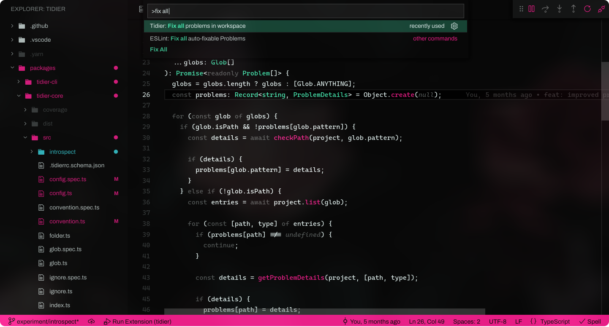

A dark, colorful and tasty theme for VSCode.

- Icons: [7ute.minimal-icon-theme](https://marketplace.visualstudio.com/items?itemName=7ute.minimal-icon-theme)
- Editor font: Cascadia Code
- UI Font: Archivo

Syntax highlighting field-tested for:

 - TypeScript & JavaScript
 - Python
 - C#
 - JSON
 - CSS and SCSS
 - Svelte
 - React
 - Rust
 - Markdown
 - shell script
 - Haskell ([#10](https://github.com/mausworks/mausworks-theme-vscode/issues/10))
